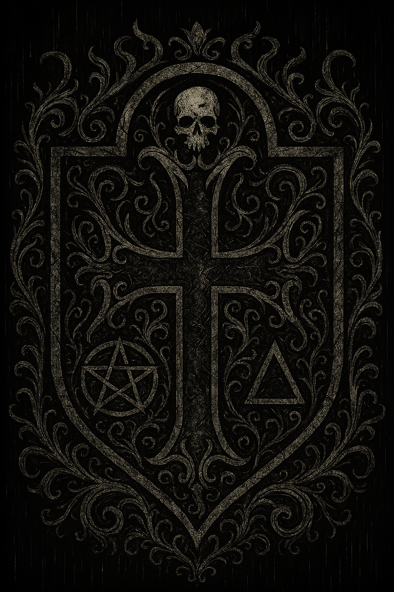
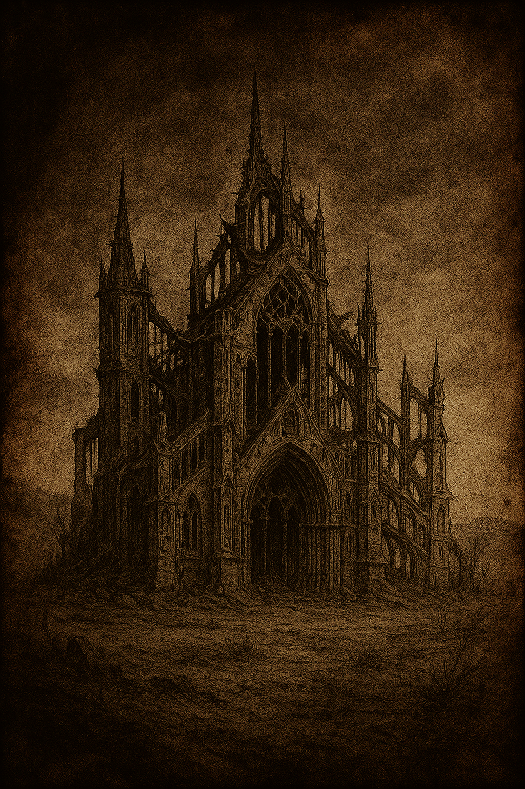
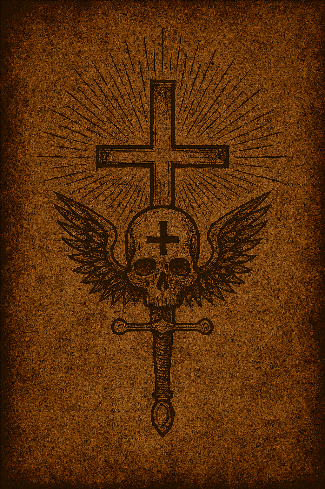
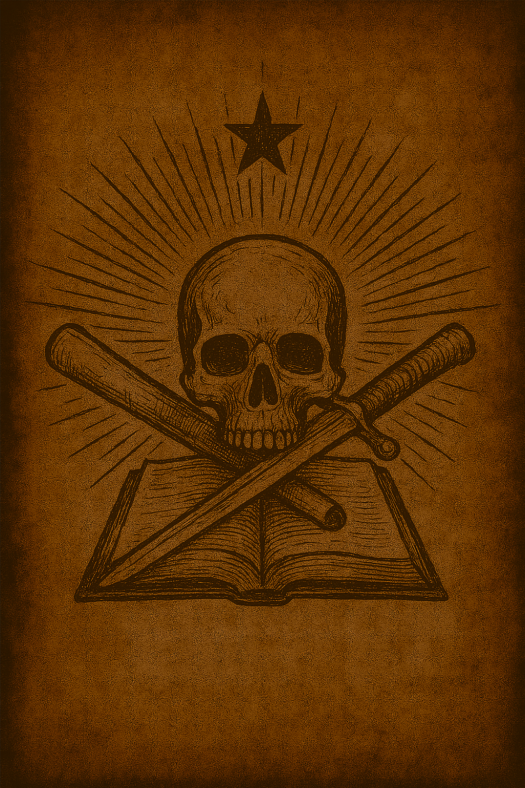
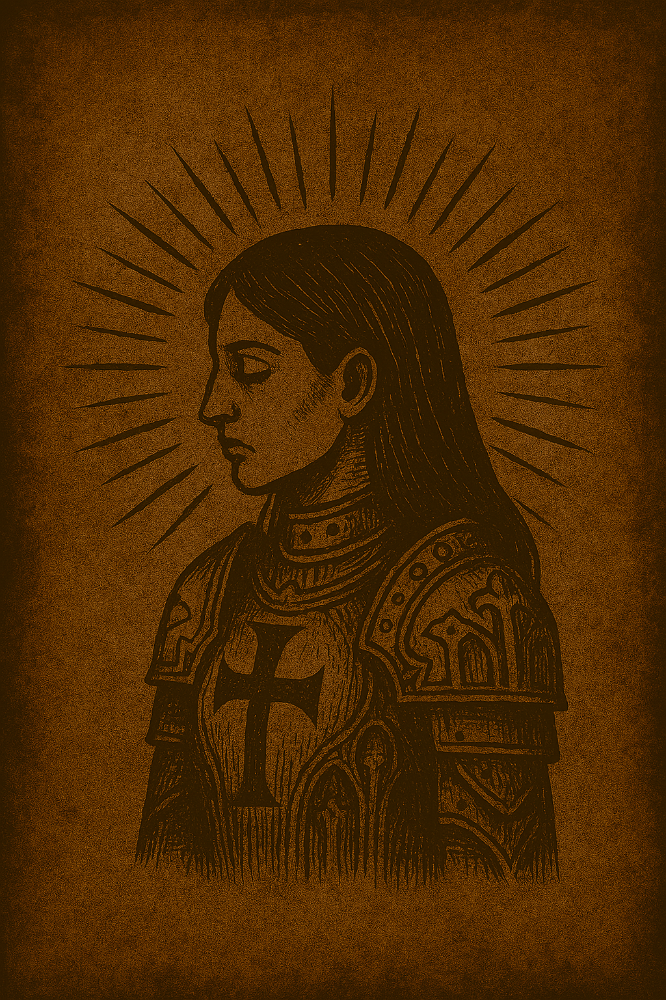
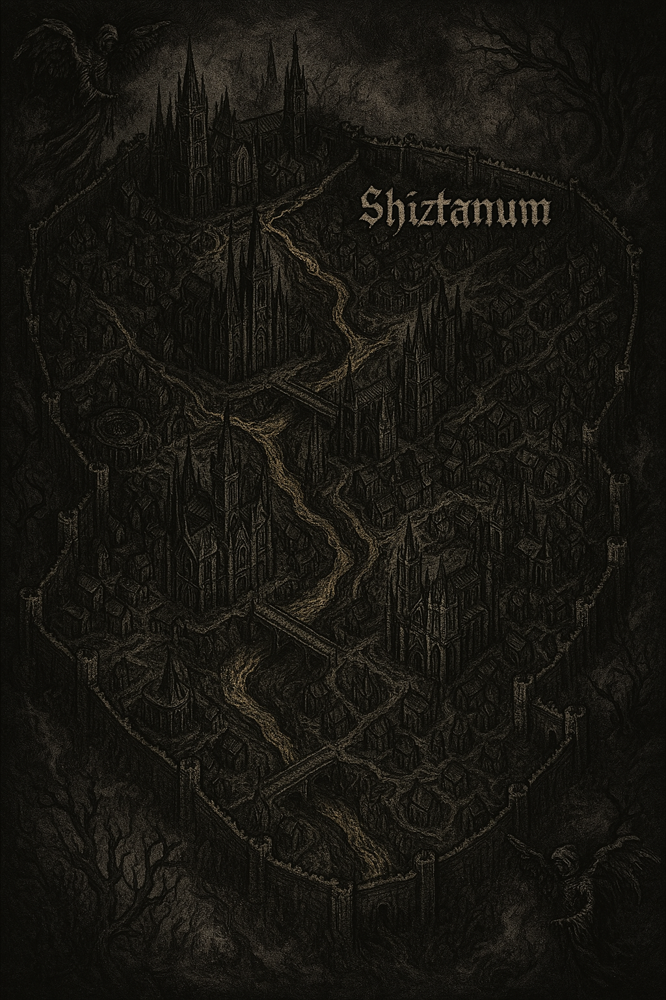

# Crucis - Mundo de Juego de Rol



## Tabla de Contenidos

- [Introducción](#introducción)
- [Geografía y Ambientación](#geografía-y-ambientación)
- [Sistema Político](#sistema-político)
- [Religión y Creencias](#religión-y-creencias)
- [Economía y Sociedad](#economía-y-sociedad)
- [Artilugios y Magia](#artilugios-y-magia)
- [Historia y Trasfondo](#historia-y-trasfondo)
- [Vida Cotidiana](#vida-cotidiana)
- [Ubicaciones Emblemáticas](#ubicaciones-emblemáticas)
- [Guías de Juego](#guías-de-juego)

---

## Introducción

Bienvenido al mundo de **Crucis**, una tierra atormentada donde la supervivencia de la humanidad depende de la fe y la fuerza. En este mundo sombrío, las manifestaciones sobrenaturales amenazan constantemente a los mortales, mientras que la todopoderosa Iglesia de la Santa Madre mantiene un control férreo sobre la sociedad.

---

## Geografía y Ambientación

### Clima y Entorno

Las tierras atormentadas, plagadas de apariciones y de la constante actividad de los Vulgus, están condenadas a la penumbra. No existen estaciones del año como tal; el clima está condicionado por la vida espiritual de la región. Este se decide por un pulso constante entre las almas dignas y las manifestaciones impuras.

Se distinguen cuatro estados de las regiones:

#### **Intermerata**
La más soleada y cálida. Aunque no es la más cómoda para los humanos, es tranquila y carece de cualquier tipo de manifestación impura.

#### **Motus Vitae**
La más próspera. Favorece la proliferación de vida, aunque ya presenta cierta corrupción en la región.

#### **Lapsus**
Aquí la vegetación tiende a morir. El clima se vuelve nublado independientemente de la hora del día. No llueve, pero la luz es escasa. Se considera un nivel moderado de corrupción. Las apariciones de los Vulgus son poco frecuentes, pero constantes.

#### **Planctus**
Cuando la corrupción alcanza su mayor grado. Las apariciones son constantes y las muertes por los Vulgus se cuentan por centenares cada mes. El cielo permanece nublado, acompañado de una llovizna persistente. Cuando se produce una manifestación, la lluvia arrecia y, si ocurren múltiples manifestaciones, puede desencadenarse una fuerte tormenta.

### Peligros Naturales

Los principales peligros naturales son las **manifestaciones**. Aún se desconoce con certeza por qué ocurren, pero estas desencadenan la aparición de entidades malignas creadas para subyugar al hombre. Estas criaturas matan, descuartizan y no muestran piedad alguna.

En regiones en estado de **Planctus**, las tormentas representan también un gran riesgo, ya que los fuertes vientos son capaces de levantar y desplazar cualquier objeto mal asegurado con gran violencia.

### Ruinas del Pasado



Todos los edificios de Crucis tienen menos de 212 años. Esto se debe a un acontecimiento conocido como **"El Llanto de la Madre Oscura"**, o más comúnmente **la Época del Llanto**. Ninguna estructura sobrevivió, salvo el **Templo de la Continua Penitencia**, hogar de los **Santos Caballeros de la Cruz**, una antigua orden de caballeros.

Se ha censurado en gran medida qué funciones cumplían realmente. La poca información existente está prohibida por mandato sagrado de la Santa Madre.

### Sitios Prohibidos

El único lugar prohibido es la **Iglesia de los Caballeros de la Santa Cruz**. Cualquier vínculo con ellos se considera una aproximación a lo profano.

---

## Sistema Político

### Estructura de poder

Todo el poder recae en la Iglesia de la Santa Madre. No hay otros rivales políticos en todas las tierras conocidas. Dentro de esta institución existen diferentes grupos, cada uno con funciones específicas. Se distinguen cuatro ramas:

#### **Gladius Dei**



El Gladius Dei compone la fuerza militar del estado: devotos y fanáticos que deben su fe y su vida al Palaneo de la Santa Madre. Son retirados de sus familias a temprana edad en una ceremonia llamada "rapto" asignando un nombre nuevo al infante. Provienen de cualquier clase social, y la decisión de quién ingresa al Gladius Dei es un misterio, aunque la orden se dicta desde el Palaneo.

Se ha especulado mucho sobre qué puede condicionar este "rapto", pero la versión oficial dicta que se realiza por decisión divina de la Santa Madre. Se compone del ejército raso y no tiene apenas poder político. Un miembro de Gladius Dei puede ascender y llegar a tener cierto poder político, pero para esto debe abandonar Gladius Dei para formar parte de alguna de las otras ramas del gobierno.

**📖 Para Jugadores:** Consulta la [Guía del Gladius Dei](player-guides/gladius-dei.md) para más información sobre cómo interpretar a estos soldados sagrados.

#### **Verbum Dei**


Son los encargados de la propaganda del estado. Cualquier ciudadano puede aspirar a esta facción, pero debe demostrar una fe indudable. Son los propios padres quienes deben entregar a su hijo desde temprana edad para que inicie el adiestramiento.

No solo dan forma al mensaje del estado, sino que también ejercen labores de vigilancia sobre la población. En caso de detectar indicios de herejía, tienen poder sobre Gladius Dei para ejercer castigo. En casos donde se considere necesaria una ejecución, el asunto se deriva al Palaneo.

#### **Liber Dei**



Se encargan del adiestramiento y las doctrinas de la iglesia. Albergan conocimiento y lo distribuyen para formar a cualquier miembro perteneciente al gobierno, abarcando todas las ramas. Ellos también son entregados desde la infancia, como los Verbum Dei.

#### **El Palaneo de la Santa Madre**



Es el verdadero núcleo de poder del estado. Tiene poder total sobre las otras tres ramas, ya que esta rama contiene la palabra de la Santa Madre. Dictan las leyes y emiten juicio en última instancia. Se encargan del comercio y de cualquier otro asunto que no pertenezca a las otras tres facciones.

Es, con diferencia, la rama más grande. La única forma de entrar es ascendiendo desde cualquiera de las otras ramas. Aunque puede ser relativamente fácil entrar, no lo es tanto llegar a la cúpula (Sanctus). Para acceder a la cúpula solo puedes ser elegido por la Santa Madre, aunque desde hace tiempo este beneficio solo se encuentra en miembros de ciertas familias, lo que ha servido para alimentar rumores. Obviamente, cualquier duda sobre la palabra divina podría considerarse blasfemia y sería castigada.

### Corrupción

Aunque no se puede determinar de forma tajante la corrupción en el sistema, sí que es muy cuestionable cómo el Palaneo interviene constantemente en todos los asuntos del estado. Entre estas intervenciones, muchas son de dudosa índole y parecen bastante arbitrarias.

Se sabe abiertamente que la cúpula vive con una indiscutible riqueza. Las elecciones de la Santa Madre con referencia a la cúpula de mando son muy sospechosas, ya que casualmente siempre recaen sobre las mismas familias. Estas familias, aunque exentas de cargos políticos, sí viven un ritmo de vida muy por encima de la media.

Dentro de los Liber también se ve esta diferencia entre los cargos más altos, al igual que en los Verbum. Los únicos que, aunque tienen una vida más que digna, no presentan estas diferencias tan exageradas son los Gladius Dei.

### Represión

La represión del estado es constante, principalmente porque son los únicos con fuerza suficiente para contrarrestar las manifestaciones. Esto genera un ecosistema en el que los ciudadanos se ven a merced de estas amenazas y dependen del estado para sobrevivir.

Cualquier intento de adiestramiento en la lucha fuera del control de la iglesia se considera nocivo para la población, por lo que puede ser castigado. El estado se aprovecha de esta situación de dependencia para oprimir ideas, comercio o cualquier tema que sea de su interés. Para hacer cumplir esta visión de gobierno, los Verbum tienen un papel crucial, ejerciendo como poseedores de la verdad moral.

### Guerra perpetua

Se han visto múltiples alzamientos esporádicos en contra de la Iglesia, lo cual es de esperar ya que en Crucis todo el mundo tiene caídos a manos del estado. En muchas ocasiones no se sabe muy bien quién tiene más víctimas: si las manifestaciones o la propia Iglesia.

Se habla de algunos sujetos no pertenecientes al estado que portan armas y tienen habilidades extrañas. Los rumores dicen que son capaces de hacerles frente a los miembros de Gladius, pero no parecen organizados. Aunque no se ha dado una versión oficial sobre estos sujetos, se rumorea que podrían ser una facción oculta, aunque parecen ser demasiado solitarios y actuar por cuenta propia.

Por otro lado, antiguamente existía un culto conocido como "Veritas Damnata". Este culto causó muchísimos problemas en el pasado. Se rumoreaba que investigaban cómo generar manifestaciones. No se sabe muy bien cuáles eran sus motivaciones, pero sí supuso un peligro real dentro de Crucis. Por lo que se sabe, este culto está extinto.

### Facciones en pugna

Realmente no hay muchas facciones, pero se podrían destacar varias fuerzas:

Los **señores del comercio**, aunque tienen una vida de bastantes lujos, juegan muy cerca de la herejía. Estas condiciones suelen ser más laxas dependiendo de lo que el estado saque de ellos. Aun así, las relaciones entre la iglesia y los señores del comercio son tensas. Aunque la iglesia es controladora total del comercio, a los señores no les gusta inclinarse ante ellos. Pueden sacar muchos beneficios, pero si tienen algún fallo de cálculo a nivel político, pueden acabar con un castigo ejemplar para el resto de señores.

Por otro lado, dentro de cada rama del estado hay discrepancias contra el Palaneo. Aunque disentir de la palabra del Palaneo está castigado, son normales las disputas por poder político entre los altos mandos de cada rama del gobierno. Entre estos mandos también suele haber tensiones. El Palaneo no interviene salvo casos excepcionales.

Finalmente estarían los desaparecidos Veritas y los sujetos solitarios que portan armas, pero de estos últimos se desconoce demasiado. El Palaneo no los considera una amenaza por su aparente carencia de organización.

---

## Religión y Creencias

### Dioses

Todas las fuerzas de la naturaleza son dioses válidos para la Iglesia de la Santa Madre. En Crucis se veneran muchos dioses, aunque por encima de estos se considera que la única consciente sería la Santa Madre, símbolo de la propia vida en sí, artífice y coordinadora del resto de dioses inconscientes.

Cada pequeño pueblo tiende a enfocarse en un **Alter**, como son llamados estos dioses menores. Más concretamente, estos dioses nacen de las propias necesidades del hombre, incluyendo sus ideas, que son necesarias para el juicio de este. Cuando una parte de una población comparte un concepto, idea o costumbre, de este mismo puede derivar un Alter.

Estos tienen manifestaciones en el mundo terrenal en forma de pequeños trazos de luz sin un origen claro. Para que un Alter sea considerado como tal, el Palaneo tendría que aprobarlo si se quiere rendir culto a este. Los motivos por los que hay que regular a estos Alter no están muy claros, pero el estado no ha sido muy claro en sus motivos, aunque sugieren que es peligroso dejar al hombre llano dar poder a entidades que no entiende.

La Santa Madre se describe como un ser celestial anterior a cualquier otro. Un día creó a la humanidad como respuesta a su necesidad de dar vida. Dio a los hombres el poder de crear a partir de su albedrío en un plano cercano a sí misma, como quien anima a su propio hijo a crear algo digno.

Aunque hay muchos textos en los que se describe más concretamente la palabra de la Santa Madre, no se comparte mucho con la gente del pueblo. Esta palabra viene filtrada por los Verbum. Quien realmente anhela el conocimiento de los misterios de la Santa Madre solo tiene un camino para llegar a su objetivo: intentar acceder a un puesto en el Palaneo.

### Cultos

Han sido muchos los cultos menores que han dado problemas a lo largo de todo el territorio que comprende Crucis. Aunque ahora mismo se goza de una relativa tranquilidad (quitando las manifestaciones de criaturas que atormentan a la humanidad, claro está), los cultos actualmente no son un problema real.

Hace 100 años era un tema de bastante importancia. Al terminar la época del llanto, una población sumida en la miseria, la pena y la desolación estaba a merced de personas autoproclamadas portadoras de la verdad, donde sus palabras en mentes perdidas proliferaban sin mucho cuestionamiento.

Al principio estas convivían, pero con su crecimiento se volvieron problemáticas: provocaban disturbios e incluso se vieron algunos atentados de los cultos más radicales. En lugar de una convivencia entre cultos, optaban por el señalamiento y condenación de cualquiera que no compartiera sus creencias.

Por estos motivos, la Iglesia de la Santa Madre, religión que precedía al llanto y que ya estaba establecida en el gobierno, tuvo que tomar medidas. Después de la época del llanto, la población se redujo a una octava parte de su volumen original. A los 70 años, la Iglesia de la Santa Madre empezó a intervenir en cultos independientes a ella.

Los siguientes años fueron una época complicada: los cultos pasaron a ser prácticamente milicias y grupos de asesinos, volviéndose más desesperadas y sanguinolentas. Poco a poco fueron mermando, hasta llegar al estado actual de Crucis, donde ahora se vive con una relativa tranquilidad en ese sentido.

### Religión y Opresión

La Iglesia de la Santa Madre justifica en gran parte su control por el hecho del don que dio la Santa Madre al hombre. Aunque libre, este necesita una consciencia superior para guiarlo, ya que el don de crear tiene un origen divino, y los humanos distan mucho de ser cualquier cosa parecida a esto.

Aunque agradecidos de este don, es el deber de la humanidad controlar a los descarriados y funcionar como una unidad. La Madre nos dio la vida y el don, pero es el deber de la propia humanidad asegurarse de que sus hermanos no hagan un mal uso de esto. Tiene el mismo sentido que vigilar a un niño pequeño jugando con fuego: puede tener acceso a un poder tan monumental, pero si lo dejas solo puede quemarse.

Esto justifica todo el control, ya que las medidas que se toman no son por el bien de la Iglesia realmente, sino por el bien de la humanidad. Y no hay nada que mejor le convenga a la humanidad que la sabia guía de la Santa Madre, que habla a través de la Iglesia de la Santa Madre.

### Rituales oscuros

Hay muchos misterios que rodean a la Santa Iglesia con lo referente a sus ceremonias internas. Lo único que es totalmente público son las ceremonias de purificación y los exorcismos de algunas manifestaciones especiales.

Hay una última ceremonia que sí es medianamente conocida, aunque no se habla públicamente de esto, y si se pregunta directamente a la Iglesia no se obtendrá respuesta tampoco. Algunos grupos de Gladius portan una caja. No se sabe para qué funciona exactamente, pero se distingue que a veces se mueve como si albergara algo vivo dentro.

Nunca se ha visto su uso directamente, pero se sabe que se usan porque muchas veces se ve que equipos que portaban estas cajas ya no las tenían a su regreso.

Por otro lado, el único culto del que la Iglesia ha hablado abiertamente sobre sus ritos son los de "Veritas Damnata" hablan de torturas, sacrificios y rituales que provocan manifestaciones. No se comentaron sus finalidades como tal, más allá de provocar el caos.

---

## Economía y Sociedad

### Desigualdad

En los pueblos colindantes, las condiciones de la gente son relativamente precarias pero no desesperadas. La gente goza de lo justo para vivir, pero la vida campestre sigue siendo relativamente agradable.

En las ciudades, la miseria sí es más presente. Dentro de los suburbios es común ver a múltiples vagabundos. La vida tiende a ser más extrema en estos lugares, pero con los contactos adecuados y una sutil riqueza no es difícil iniciar un comercio que, aunque no daría una vida de lujos, sí te dotaría de lo justo para vivir.

Por otro lado, la vida de la gente más cercana a la iglesia o con cierto poder político es mucho más cómoda. También dentro de los gremios de comercio es posible gozar de ciertos lujos.

La diferencia entre las clases es descarada, y yace cierta hipocresía, ya que las clases más altas promueven la vida honesta como señal de devoción, mientras ellos viven vidas cómodas parasitando las producciones del pueblo, ya sea de forma parasitaria como el propio gobierno o a través del trabajo mal pagado de los grandes señores del comercio, dando a los trabajadores lo justo: suficiente para no enfermar, pero no demasiado como para que puedan proliferar y ofrecer un futuro rival comercial.

### Esclavitud/servidumbre

En Crucis el esclavismo está prohibido, aunque realmente las condiciones en las que viven muchos trabajadores se podrían considerar como tal. Aunque a nivel burocrático no lo dicte claramente, es normal que un señor del comercio o de la industria retenga los permisos de viaje de sus propios empleados, obligando a estos a estar a merced de sus propios jefes para que les conceda permiso para poder viajar a otros lados.

Es bastante normal que el empleador se niegue, diciendo que lo necesita. No se pide que dé un motivo que justifique esto, lo que da rienda suelta a que estos abusen de este poder. Aunque las horas de trabajo sí están reguladas, se da el tiempo justo para que el empleado pueda dormir y practicar devoción a la Iglesia. Algunos usan el tiempo de esto último para realizar tareas ociosas, lo cual no se persigue realmente.

Por otro lado, lo más parecido a la esclavitud que se puede encontrar en Crucis serían los trabajos de los criminales para la Iglesia de la Santa Madre. El sistema penal consiste en una estructura de trabajos forzados sin paga. Si eres detenido y condenado, solo tienes dos destinos: por un lado, la ejecución para los casos más graves; por otro, los trabajos en los campos de fe.

Este trabajo no se paga. Se considera como un retiro espiritual para que el reo medite sobre sus acciones. A su vez, los frutos del trabajo del preso van para la Iglesia. Se considera una compensación social para arreglar mínimamente el daño causado a la humanidad.

Este planteamiento se basa en dos enfoques: la utilidad del individuo para el pueblo, forzándolo a hacer algo útil para sumar valor a la sociedad; por otro lado, los trabajos forzados se consideran una penitencia a pagar que sana el alma y purifica la mente, pagando una deuda divina más allá de la compensación terrenal que se pagaría con el fruto de su trabajo.

### Mercado negro

Dentro de cada ciudad grande es conocido que hablando con determinadas personas se puede acceder a ciertos artilugios extraños no pensados para la gente común. Por ejemplo, los instrumentos suelen estar mal vistos entre la gente de la ciudad. Se dice que provocan que las manifestaciones sean más numerosas, pero realmente la Iglesia no tiene una pronunciación fija sobre estos hechos.

Algunos responsables de distritos de la Iglesia sí pregonan en contra de estos, pero más por decisión propia que por una ordenanza del Palaneo. Igualmente, sigue estando mal visto, así que es difícil ver estos artilugios en los comercios normales, por lo que la forma más fácil de acceder a estos es por medios poco convencionales. Esto aviva más la mala visión que se tiene de estos artilugios, al igual que la mala reputación que tienen las personas que poseen uno.

Sin embargo, en los pueblos está más normalizado y no se ve con tanto recelo, aunque estas gentes conocen la opinión que merecen en un contexto urbano.

Por otro lado, se sospecha que los señores de comercio tienen relación con el tráfico de estas mercancías. Aunque no está demostrado, es bastante evidente, ya que en algunas intervenciones de la Iglesia sobre estas actividades se han encontrado muchos artilugios valiosos que chocan con las posibilidades adquisitivas que podrían tener los miembros que ejercen este molesto contrabando.

Aun siendo en parte evidente, la Iglesia tiende a hacer la vista gorda con los señores del comercio que parecen estar más implicados en estas actividades, ya que muy presumiblemente también suelen tener cierto poder político aun sin ser integrantes de la Iglesia como tal.

### Moneda de la desesperación

En todo el territorio de Crucis existe el concepto de **Obulus pro servitio**, comúnmente llamado solo Obulus pro. Se suele utilizar en dos contextos:

Cuando una persona desesperada necesita un bien básico para subsistir pero carece de cualquier posesión para conseguirlo, puede ofrecer un Obulus pro. Es un ofrecimiento de favor a cambio de este bien, lo que lo pone en una situación vulnerable a la decisión de la persona a la que se le ofrece.

Los límites que comprenden este acuerdo son dos: la orden dada no puede atentar contra la vida de la otra persona, y por otro lado, tiene que ser una solicitud viable para la otra persona. Estas dos normas son vagas, porque sí se permite una paliza, por ejemplo, ya que es un fin viable para la otra persona pero no atenta contra la vida de la otra persona.

Tal es el extremo de la interpretación de la primera norma, que se le podrían romper las piernas al convocador de un Obulus pro sin ninguna repercusión si este no muriera en el proceso. El hecho de negar un Obulus pro por cualquiera de las dos partes se puede considerar un acto ilegal, ya que este se considera un derecho desde la propia Iglesia, siendo un concepto arraigado directamente en la religión y en la cultura de Crucis, una antigua tradición que prevalece a día de hoy.

El segundo contexto, si se declara como un Obulus pro servitio sin acortar, se daría en clases más altas como favores. Estos sí son más irregulares. Ambas partes se pueden negar al acuerdo después de declarar el Obulus pro servitio, aunque tanto cuando se convoca como cuando se ejecuta suele ser en un entorno privado, ya que aunque se pueda negar, se considera mal visto hacerlo, por eso se prefiere optar por esa privacidad.

Los acuerdos comerciales se disfrazan de Obulus pro servitio para los ojos externos. Realmente, entre las altas esferas, convocar un Obulus pro servitio sin una motivación de disfrazar un acuerdo comercial con un halo tradicionalista se considera una rendición por una de las dos partes y algo que denota debilidad.

Este segundo uso del Obulus pro es más complejo y está atado a interpretaciones, por lo que los matices exactos pueden variar de una región a otra. Parte de las características de un buen señor del comercio que se mueva entre regiones es conocer las características propias de cada región con lo referente al Obulus pro servitio.

---

## Artilugios y Magia

### Artilugios perdidos

Todo lo relacionado con la historia pre-Llanto está guardado con recelo por el Palaneo. Aunque la historia sea muy próxima a la actual, se ha conseguido enturbiar suficientemente la historia como para que no se sepa mucho sobre ella. Solo ha sobrevivido saber popular a través de las voces de la gente.

Una de las cosas de las que se habla es de los **Indicium**, artilugios divinos usados por la iglesia anteriormente, capaces de afectar a distancia a las manifestaciones. Estos misteriosos artilugios se consideran señal de voluntad divina de la resistencia humana ante los Vulgus y otras entidades de origen impuro.

Según se cuenta, estos artilugios eran comunes entre los Gladius. De normal había como mínimo uno por cada grupo de exterminación. Un solo "señalamiento" del artilugio era suficiente para desterrar del plano terrenal a la mayoría de las manifestaciones comunes. De lo contrario, incapacitaba parte del cuerpo de la entidad: no acababa con esa parte de una forma grotesca, simplemente la exiliaba del dominio de la entidad, imposibilitando así el uso de esta parte.

Durante su uso, se decía que era fácil controlar a las manifestaciones y era bastante raro que una región sufriera de un estado Lapsus, aunque en alguna gran ciudad sí que podría verse afectada por este. De normal nunca se llegaría a tanto.

Durante El Llanto, los Indicium dejaron de funcionar por algún motivo que se desconoce. La Iglesia los recolectó apresuradamente con su recelo habitual. La forzada inhabilitación de los Indicium, junto a los eventos de El Llanto, sumieron en un estado de Planctus a todo el territorio de Crucis durante poco más de dos largos años.

Aunque El Llanto cesó, los Indicium no se volvieron a ver. Algunos señalan como una posibilidad la relación de estos artilugios con El Llanto, pero los Indicium ahora mismo se consideran un relato difuso, ya que la información más veraz solo la tendría la Iglesia, y esta no ha vuelto a hacer ninguna mención a ellos que se recuerde.

### Magia

Las artes arcanas son algo habitual y conocido en Crucis. No se duda de su existencia. Los Gladius habitualmente usan habilidades extrañas para el pueblo cuando hacen alguna incursión con un grupo de exterminación para purificar una manifestación.

Se destacan poderes de curación, con algunas limitaciones contra heridas provocadas bajo algunas circunstancias extrañas. También algunas de las armas de los Gladius se han visto brillar con colores extraños, algunas incluso cambiando de forma. Otros dicen que algunos portan artilugios extraños capaces de generar extraños símbolos al impactar contra superficies o criaturas.

Muchas veces se observa cómo alguno de los miembros de estos grupos se quedan alejados del grupo susurrando extrañas palabras mientras el resto del equipo forma a su alrededor para protegerlo. Aunque nunca nadie ha visto hacer algo a esos sujetos, esto se debe principalmente a que todo lo que se menciona de los avistamientos de estos grupos de exterminación viene de gente que huía de las manifestaciones.

Por algún motivo, las abominaciones prefieren evadir a los exterminadores y priorizan a los civiles, lo que significa que los que se quedan demasiado tiempo siempre acaban muriendo de forma extraña.

### Armas prohibidas

Cualquier arma está terminantemente prohibida para los civiles. Algunos pueden portar armas, pero la Iglesia de la Santa Madre tiene que aprobarlo. En caso de que se descubra el arma, el castigo será proporcional al tipo de arma que se porte.

En caso de ver a un civil usando cualquier tipo de arte arcana, se le puede catalogar de hereje y los Gladius tienen autorización para ejecutar al culpable en caso de que no sea viable su traslado al Palaneo para ser juzgado.

---

## Historia y Trasfondo

### El Llanto de la Madre Oscura

El Llanto de la Madre Oscura fue el acontecimiento más trágico recordado por Crucis hasta el momento. El nombre viene porque la lluvia constante durante esa época era de un color negro oscuro. Aunque no se hace referencia real a una forma divina contrapuesta a la Madre Santa, el pánico hizo que la gente pensara que una deidad contrapuesta a la Madre Santa era causante de esto.

A la Iglesia no le gusta el término El Llanto de la Madre Oscura porque lo considera demasiado cercano al nombre de la Madre Santa. En parte, aunque a veces sí se ha llegado a castigar su uso, no se le da una importancia tan grande, pero sí prefiere usar el término de El Llanto sin más para referirse a esta época.

En esta época se conocen tres grandes acontecimientos:

#### **Furtum**
Fue la primera señal, cuando dejaron de funcionar los Indicium. A su vez, de forma abrupta, a los pocos días se produjo un Lapsus generalizado.

#### **Vastitas**
La época más atroz de El Llanto, donde se produjo el Planctus por todo Crucis. Aparecieron manifestaciones colosales, las tormentas también eran muy comunes y fue prácticamente una guerra en cada ciudad, una refriega en cada pueblo, una masacre en toda regla.

Los únicos que resistieron fueron las Iglesias más fuertes, muchas pertenecientes al culto de la Madre Santa. Se reagruparon en bastiones y los propios edificios sirvieron de bastiones. Épocas de hambruna y tragedia.

Curiosamente, cuando más cerca estaban de morir por completo, la situación mejoraba ligeramente para luego volver a dificultarse, como el asesino que estrangula a su víctima para dejarle que tome una bocanada de aire, darle una esperanza que ella coge con desesperación, para posteriormente volver a apretar sus manos contra su garganta, regodeándose de su sufrimiento.

Se desconoce el porqué de estos ciclos, aunque algunos miembros de la Iglesia sugieren que era intervención de la Santa Madre para evitar que su creación, la humanidad, desapareciera por completo, aunque con su poder mermado por alguna razón desconocida, no podía mantener durante mucho tiempo esos valles dentro de la desolación.

#### **Salus**
Este marcó el fin, con el cese de la lluvia negra. Estas últimas arrasaron y provocaron algunas inundaciones en algunos lugares no acostumbrados a sufrir el Planctus. Para la gran mayoría no fue mucho problema, porque en Crucis todo se construía pensando para resistir estas lluvias de forma prolongada, aunque algunos pueblos no tuvieron tan presente esta posibilidad.

### Post El Llanto de la Madre Oscura

Después de El Llanto, empezó la reconstrucción a los pocos meses. El esfuerzo fue encabezado por la Iglesia de la Santa Madre, que fue con diferencia la institución que mejor resistió la arremetida de El Llanto.

Algunas ciudades acabaron completamente destruidas y se dejaron atrás. El único edificio que "resistió" fue el templo de la continua penitencia. Este se abandonó y se prohibió su entrada a cualquier persona que no estuviera autorizada por la Iglesia. Una de las medidas para esto fue borrar cualquier mención de este edificio en cualquier mapa. No se sabe a ciencia cierta dónde se halla este edificio.

También es bastante misterioso el porqué se prohibió su acceso. La única versión que se ha dado de forma pública a esto es que se realizaban rituales paganos en ella, de mano de una orden corrupta: los llamados **Caballeros de la Santa Cruz**.

Se ha intentado borrar la existencia de esta orden del público general, pero igualmente un retazo de su existencia vive en las mentes de la gente. Se rumorea que eran grandes caballeros, incluso que tuvieron un rol parecido a los Gladius de la Iglesia, pero con unas habilidades claramente superiores a estos. Se habla de ellos como caballeros de gran honor que atendían con la misma dedicación a todos por igual, independientemente de su clase social.

Pero no se sabe muy bien por qué un día se corrompieron. No hay muchas explicaciones del porqué, y muchas veces es difícil distinguir qué es real sobre la versión oficial que da la Iglesia de si se corrompieron o no. Pero hay rumores que ponen a los Caballeros de la Cruz como parte importante para el inicio de El Llanto, aunque, como es bien conocido, la información sobre lo sucedido referente a los Caballeros de la Cruz con relación a la época de El Llanto es escasa y confusa.

### Shiz

Shiz era uno de los miembros más importantes de Gladius durante El Llanto. Él encabezó la resistencia y salvó a muchos de los civiles durante esos tiempos difíciles. Fue quien se encargaba de coordinar a las diferentes agrupaciones de la Iglesia de la Santa Madre para guardarlas a todas en el Bastión de la Esperanza.

Él se encargaba de hacer las caravanas para fortalecer el Bastión y trasladar a la gente de los pueblos. Lo que empezó como un pequeño refugio para resistir El Llanto, con el tiempo fue creciendo hasta convertirse en un símbolo de resistencia, con toda la fuerza militar de la Iglesia concentrada en un solo punto. Todas esas fuerzas estaban lideradas por Shiz.

Después de El Llanto, ese bastión desembocó en una gran ciudad de las más importantes de Crucis. A esta ciudad y a sus alrededores se les conoció como **Shiztanum**, en honor a Shiz.

Se rumorea que Shiz aprovechó la situación para arremeter contra la Iglesia y adquirir gran poder en la organización. La cúpula desapareció misteriosamente, pero no hay información, al menos pública, que haga referencia a esto.

---

## Vida Cotidiana

### Criminalidad

La criminalidad, aunque presente, no es un gran problema dentro de la región de Crucis. La criminalidad se basa más en el contrabando que en actos más severos como el robo. Hay barrios que sí podrían considerarse más peligrosos que otros. El asesinato es algo extraño en estos lugares, pero los robos sí podrían ser ligeramente más comunes.

Independientemente del barrio, siempre se ejerce un gran control sobre la población mediante patrullas de Gladius, por lo que la criminalidad siempre está controlada hasta cierto punto.

### Enfermedades

Por todo el territorio de Crucis, las enfermedades son relativamente comunes, sobre todo en las ciudades. La falta de higiene y la alimentación poco variada de los habitantes de clases humildes hacen estragos entre la población.

Las principales víctimas de esto serían los más jóvenes. A partir de los 12 años es más probable que lleguen a la edad adulta, pero un adulto tampoco está totalmente exento de la malnutrición o de las infecciones, aunque sí tienden a tener una probabilidad de recuperación más alta.

Todo el pueblo de Crucis tiene como derecho el acceso gratuito a los sanadores de la Iglesia de la Madre Santa. Por eso mismo, las infecciones tienden a ser poco letales, pero la malnutrición no se suele tratar con efectividad, por lo que las muertes relacionadas con enfermedades suelen estar relacionadas con estas.

Por otro lado, la población no ve con buenos ojos ir a estos curanderos, por temor sobre todo, lo que hace que mucha gente acuda demasiado tarde a estas instituciones en busca de auxilio. Cuando van, el daño es irreversible. En caso de una incapacitación permanente que imposibilite su función para la humanidad, se contempla la ejecución, no sin antes considerar una reinserción en otro sector, claro está.

Si se percibe que alguien está enfermo, la Iglesia tiene potestad para obligar a la persona a someterse a tratamiento de forma forzada, pero normalmente es una obligación que no se suele ejercer a no ser que se denuncie. Las denuncias suelen venir de los propios empleadores, pero normalmente se limitan a romper sus contratos y a contratar nuevo personal, dejando a su suerte al moribundo.

### Educación

Los únicos que tienen permitido ejercer enseñanza en la erudición son los miembros de Liber. El resto de funciones artesanales las pueden ejercer los propios maestros artesanos, aunque la Iglesia también ofrece servicios gratuitos para aprender un oficio. Más tarde pueden optar a la posibilidad de emprender un negocio donde la Iglesia controlaría todas las decisiones importantes en torno a este.

Esta posibilidad va según méritos y recomendaciones de los miembros de los Liber para asegurar que a quien se le ofrece esto es apto. Se puede pasar de este estado, en el que el verdadero propietario del negocio es la Iglesia, a un estado en el que el negocio pasa al artesano. Para ello se tiene que pagar tres veces la inversión de la Iglesia para iniciar el negocio. Para esta suma no cuenta el dinero que saque la Iglesia del negocio mientras que el artesano ahorra la cantidad para pagar este tributo.

Una vez pagado el tributo, el propietario sería el artesano. Seguirá pagando a la Iglesia igualmente, pero este controlará toda la gestión del negocio. Podrá sacar más dinero para sí mismo, pero tendrá que pagar una parte proporcional de este a la iglesia dependiendo de sus ganancias. Obviamente, el derecho a veto de comercio sigue perteneciendo a la Iglesia.

Al artesano que consigue realizar este proceso se le conoce como **"autonomus"**. Se le concede el título de maestro artesano y es uno de los primeros pasos para ser maestro de comercio. Aunque esta estructura está pensada para artesanos, también se aplica a los que ofrecen servicios.

La omisión de pagos de cualquier tipo o intento de fraude está penado según la consideración del daño que se considere que se ha provocado a nivel económico, siendo la pena mínima trabajos forzados perpetuos y la máxima la ejecución.

### Educación para miembros del estado

La educación de los miembros del estado se inicia desde la infancia, ya sea por entrega voluntaria de los progenitores a temprana edad o por otro lado partiendo del "rapto" si hablamos de los Gladius.

Su educación se basa por partes iguales en las artes de su rama dentro del gobierno y la devoción a la Iglesia de la Santa Madre. Siguen el mismo esquema horario que una jornada laboral, con la diferencia de que a estos apenas se les permite tiempo de ocio. Aunque los civiles sí pueden optar entre dedicar su tiempo libre a ser devotos o a ser ociosos, en el caso de estos el tiempo se reduce y se les obliga como mínimo a dedicar dos terceras partes de este a la devoción.

Según méritos pueden optar a más privilegios. Cuando son miembros funcionales del gobierno tienen más libertades en lo que se refiere a dedicar su tiempo.

---

## Ubicaciones Emblemáticas

### Ciudades

#### **Shiztanum**



Antiguo Bastión de la Esperanza, gran ciudad que alberga el Palaneo de la Santa Madre. Esta tiende a estar en un estado de Lapsus. En las ciudades es común que este sea su estado habitual; no se sabe muy bien por qué.

Actualmente la Iglesia de la Santa Madre está reforzando las incursiones contra las manifestaciones sobre la ciudad, ya que teme que pase a un estado de Planctus. Por algún motivo, las manifestaciones son cada vez más habituales.

Si Shiztanum transicionara a Planctus sería algo vergonzoso, ya que prácticamente es la capital de la Iglesia de la Santa Madre. Aunque no sea la ciudad más grande, sí tiene un alto valor simbólico por su historia.

---

## Guías de Juego

### Para Jugadores

- **[Guía del Gladius Dei](player-guides/gladius-dei.md)**: Guía completa para interpretar a los soldados sagrados de la Iglesia

### Para Directores de Juego

- Recursos adicionales para dirigir campañas en el mundo de Crucis próximamente

---

## Estructura del Repositorio

```
crucis-rpg/
├── README.md
├── images/
│   ├── BCO.9dd21e5e-b07f-4de3-b33c-88f8f0d765d2.png
│   ├── BCO.7b263d47-aab9-400d-b1dc-e3d5b224d252.png
│   ├── BCO.935d9e11-41b5-4baf-90c9-178d6a6afdd4.png
│   ├── BCO.87899ca7-5715-42fc-b086-6158c07ce037.png
│   ├── BCO.6925d25c-299e-4164-9e0e-cfcb5ad157eb.png
│   ├── BCO.6e69103b-0899-40f6-9b34-a377f574dced.png
│   └── BCO.89333dfb-e96e-45ba-a7cb-fa90cd5947e2.png
├── player-guides/
│   └── gladius-dei.md
├── gm-resources/
│   ├── manifestations.md
│   ├── npcs.md
│   └── adventures.md
└── lore/
    ├── detailed-history.md
    └── forbidden-knowledge.md
```

---

**¡Que la Santa Madre guíe vuestros pasos en las tierras atormentadas de Crucis!**